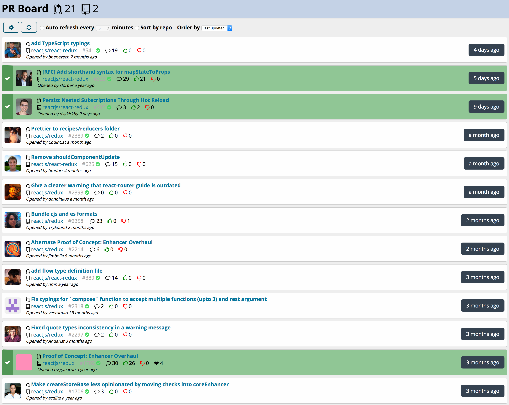

# github-pr-dashboard

See pull requests at a glance, across multiple repos



# Configuration

Copy the file `src/config/config.json.sample` to `src/config/config.json`. If you are accessing public GitHub, you don't need to change the `apiBaseUrl` option. If you are accessing a GitHub Enterprise instance, you will need to set `apiBaseUrl` to the base URL of your GitHub Enterprise installation, e.g. `https://github.mycompany.com/api/v3`.

Under the `repos` option, list all the repositories from which you want to see pull requests. The repository should be given in the format `owner/repoName`, e.g. `joeattardi/github-pr-dashboard`.

GitHub places a very strict rate limit on unauthenticated requests. If you run into this problem, you will need to add your GitHub username and password in `config.json`.

## Example `config.json`

```json
{
  "apiBaseUrl": "https://api.github.com",
  "username": "joeattardi",
  "password": "123456",
  "repos": [
    "joeattardi/github-pr-dashboard",
    "joeattardi/promise-poller",
    "joeattardi/tailstreamer"
  ]
}
```

## Displaying 👍 and 👎 Comment Counts

Maybe your team has some code review guidelines expressed through comments. For example, a pull request has to have at least one "+1" or "👍" comments and no "-1" or "👎" comments. You can configure the dashboard to display the positive and negative comment counts in the `comments` section:

```json
{
  ...
  "comments": {
    "positive": [
      ":+1:"
    ],
    "negative": [
      ":-1:"
    ]
  }
}
```

And the result will look like this:


Now you can quickly glance at which pull requests are ready to merge and which ones need attention.

You can use the short-codes for any GitHub emoji - make 💃 (dancer) positive and 🌵 (cactus) negative, go nuts!

## Displaying Reaction Counts

Should work automatically. Reactions will also count towards your postive and negative totals if using that feature. If you want to disable the reaction feature, simply add reactions: false to your config json

# Building

After you have configured the dashboard, run `webpack` to build the app. The result will be in the `dist` directory, which you can then copy into your web server to serve it from.
